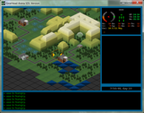
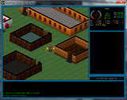
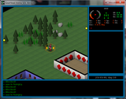

This is a fork of GearHead RPG by Joseph Hewitt. This fork has had its graphics 
modified so that they use 32-bit graphics with an alpha channel, causing the 
graphics to appear crisper and smoother.

* 
* 
* 

**************************
***  GEARHEAD  README  ***
**************************

Welcome to GearHead. This is, as far as I know, the world's first roguelike
mecha role playing game. I hope you enjoy playing it.

You may find the game a bit confusing at first. If you've played other
roguelike games (Moria, Angband, ADOM) or other mecha games (MechFight,
Titans of Steel, Power Dolls) before, you'll be less confused. If you're
familiar with both types of game then you may even feel right at home.
The file doc/introduction.txt has some information and hints for new
players.

If you can't find the information you need, check the 'doc/' directory.
If you're still lost you can check the homepage:

  http://gearheadrpg.com

****************************
***  COMPILING THE GAME  ***
****************************

First, you need a copy of the source code. If you are reading this you probably
already have it. Next, you need to install FreePascal and the SDL 1.2 libraries.
Open a terminal in the folder with the source code and type:

    fpc -dSDLMODE gharena

For the ASCII version, just type:

    fpc gharena

If everything you need has already been installed, that should be it.

Windows Notes: You need to download the binaries for SDL 1.2, SDL_TTF for
SDL 1.2, and SDL_IMAGE for SDL 1.2. Put the .dll files in the same folder
as gharena.exe.

Linux Notes: You need the packages libsdl1.2, libsdl1.2-dev, libsdl-image1.2,
libsdl-image1.2dev, libsdl-ttf2.0-0, and libsdl-ttf2.0-0dev.

****************************
***  THE  GAME  DISPLAY  ***
****************************

MAP WINDOW

	This is the big area with the cyan border.

INFORMATION WINDOW

	This is the small area in the upper right corner of the screen.
	Here you will find the vital stats for your character, or whatever
	you happen to be looking at.

	Below the name in the information window are some useful indicators.
	Starting at the left is the position indicator; the white '+' shows
	what direction you are facing, while the number in the center
	indicates your elevation. If the number is blue, it indicates your
	depth underwater.

	Nest to the position indicator should be a damage indicator. For
	characters, this will just show your health points. For mecha, the
	damage indicator shows a schematic of all the mecha's parts
	indicating which bits have taken the most punishment.

MENU WINDOW

	Beneath the information window is the menu window. This is where
	the control menus will appear.

CLOCK WINDOW

	Beneath the menu window is the clock. This will show the current
	game time. GearHead uses a clock-based game engine. Any action your
	character can perform takes a certain amount of time. Once a
	command is entered the clock advances until the action is completed
	and control is returned to the player.

	If you've played either MechForce or Titans of Steel you should be
	familiar with this control type already. If you've played any of the
	Final Fantasy games with the combat pause option on you should be
	able to figure it out pretty quickly.

MESSAGE WINDOW

	The message window is meant to provide the narration for GearHead,
	though at the moment it's mostly sleeping on the job and spouting
	cryptic acronyms. I will work on making this window more useful...

**********************************
***  CONTROLLING  YOUR  MECHA  ***
**********************************

There are an awful lot of different movement and attack options
in this game. Characters are controlled through a hopefully-familiar
roguelike interface, while mecha are controlled using a menu interface
similar to the one used in the old Amiga MechFight game (and more
recently in Titans of Steel).

MOVEMENT MENU

	This is the top layer of the menus.

	A mecha can travel at two speeds- CRUISE SPEED and FULL SPEED.
	While traveling at FULL SPEED, the mecha moves faster than
	normal, but it recieves a significant penalty to its attack
	rolls.

	WALKING is, in general, a slow way to move around. However, it
	does have several advantages. Turns can be made very quickly
	in this move mode. Also, walking mecha are better able to deal
	with rough terrain.

	ROLLING mecha use wheels or treads to move about. This move
	mode is faster than WALKING, but usually slower than SKIMMING.
	Mechas using this mode are more strongly affected by terrain.
	They have a harder time passing difficult terrain, but receive
	a greater speed bonus when traveling on roads.

	SKIMMING mecha hover several meters off the ground. They may pass
	over low obstacles without slowing down, and may fly across the
	surface of bodies of water.

WEAPONS MENU

	From here you should see a list of all the weapons your mecha
	is equipped with. You can select a weapon, then select a target
	to fire at.

	When a weapon is fired, it cannot be used again for a short
	period of time. Most weapons will recharge in 30 clicks, though
	some will be faster or slower.

	CALLED SHOT: If this option is set to "ON", the player will be
	able to select which part of the enemy mecha he wishes to
	hit. It is more difficult to make a called shot than it is to
	make a regular shot.

	WAIT FOR RECHARGE: Sometimes there will not be any weapons
	available to fire with. Select this option to wait until your
	next weapon recharges.

	OPTIONS: This will take you to the game options menu. You can
	select either menu-based or roguelike control. Note that when
	changing control type, it may be necessary to enter one last
	action in the previously selected control mode before the change
	will take effect.

	BALLISTIC WEAPON BV, ENERGY WEAPON BV, and MISSILE BV allow you
	to set the rapid fire settings for ballistic weapons, energy beam
	weapons, and missile launchers. The value selected for MISSILE BV
	indicates what fraction of the total missile payload will be
	fired in each salvo. So, if a missile launcher contains 20
	missiles and the BV is set to 1/4, five missiles will be launched
	when it is fired.

************************
***   DISTRIBUTION   ***
************************

GearHead: Arena is distributed under the terms of the LGPL. See "license.txt"
for more details.

pyrrho12@yahoo.ca
http://gearheadrpg.com
https://github.com/jwvhewitt/gearhead-1

